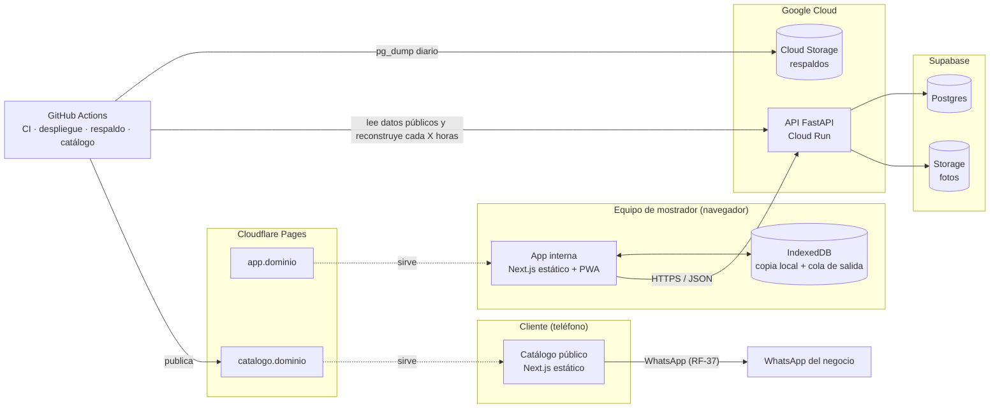

# Arquitectura — SHT Gestión

| Campo | Valor |
|---|---|
| Versión | 1.0 |
| Fecha | 2026-10-07 |
| Estado | Vigente (aprobada al cerrar la etapa 1.0) |
| Documentos relacionados | `docs/PRD.md`, `docs/decisiones/`, `.specify/memory/constitution.md` |

> Este documento describe **cómo** se construye el sistema. El **qué** y el **por qué**
> están en `docs/PRD.md`. Las decisiones y sus alternativas están en los ADR de
> `docs/decisiones/`; aquí se resumen y se enlazan.

## 1. Vista general



| Componente | Tecnología | Responsabilidad | ADR |
|---|---|---|---|
| API | FastAPI (Python) en Cloud Run | Toda la lógica de negocio, permisos, auditoría; única puerta a los datos | 0001, 0002, 0005 |
| Base de datos | Postgres en Supabase | Persistencia; sin Data API expuesta | 0001 |
| Fotos | Supabase Storage | Fotos de productos | 0001, 0002 |
| App interna | Next.js estático + PWA en Cloudflare Pages | Ventas (con y sin conexión), caja, administración, inventario, compras, reportes | 0001, 0003 |
| Catálogo | Next.js estático en Cloudflare Pages | Catálogo público y pedido por WhatsApp; regenerado cada X horas | 0001, 0002 |
| Automatización | GitHub Actions | CI, despliegues, respaldo diario, regeneración del catálogo | 0002 |

## 2. Repositorio

```
backend/
  app/
    api/          endpoints (routers), dependencias de autenticación y roles
    domain/       reglas de negocio puras: dinero, unidades, costo promedio, caja
    services/     casos de uso transaccionales (registrar venta, confirmar compra…)
    db/           modelos SQLAlchemy, sesión, repositorios
    core/         configuración, seguridad, logging
  migrations/     Alembic
  tests/
frontend/         app interna (Next.js, PWA)
  src/
    app/          rutas (ventas, caja, productos, inventario, compras, reportes, admin)
    lib/offline/  Dexie, cola de salida, sincronización
    lib/api/      cliente HTTP con tipos generados del OpenAPI
catalog/          catálogo público (Next.js estático)
packages/shared/  TypeScript compartido: dinero, formato es-VE, tipos generados
shared/
  test-vectors/   casos JSON que ejecutan las pruebas de Python y de TypeScript
docs/
.github/workflows/
docker-compose.yml  entorno local (Postgres)
```

La regla de dependencias del backend es `api → services → domain` y
`services → db`. `domain` no importa nada de la base de datos ni de FastAPI, para que
las reglas críticas se prueben sin infraestructura (principio VII).

## 3. Flujos principales

### 3.1 Venta en el mostrador (con o sin conexión)

1. El vendedor busca productos en la copia local (IndexedDB). La búsqueda no depende de
   la red (RNF-04).
2. La app calcula totales en USD y Bs con la última tasa local, mostrando su fecha si no
   es la del día (RF-18), usando `packages/shared/money` (ADR-0004).
3. Al confirmar, la venta recibe su número `{serie}-{correlativo}` y un UUIDv7, y se
   guarda en la cola de salida (ADR-0003).
4. Si hay conexión, se envía de inmediato; si no, cuando vuelva.
5. La API valida la sesión y el equipo, recalcula la venta, aplica en una sola
   transacción la venta, los pagos, los movimientos de kardex y de caja, y la auditoría.
6. Si el stock queda negativo, el precio no coincide o el total difiere, la venta se
   registra igual y se crea una alerta para el admin (RN-10).
7. La respuesta se guarda localmente y la operación sale de la cola. Un reintento de la
   misma operación devuelve el mismo resultado sin duplicar.

### 3.2 Operaciones con conexión (administración, compras, inventario)

La app llama a la API directamente. Cada caso de uso es una transacción: por ejemplo,
confirmar una compra crea los movimientos de entrada, recalcula el costo promedio con
bloqueo de fila del producto (RN-09) y audita, todo o nada.

### 3.3 Catálogo público (RF-34 a RF-38)

1. Un workflow programado (cada X horas, configurable) llama a un endpoint de solo
   lectura de la API protegido por token, que devuelve únicamente campos públicos:
   nombre, descripción, atributos, precio USD, disponibilidad ("Disponible" o
   "Agotado") y fotos. Nunca costos ni cantidades.
2. Calcula el precio en Bs con la última tasa BCV y muestra su fecha.
3. Descarga las fotos optimizadas dentro del build y publica el sitio estático en
   Cloudflare Pages.
4. El pedido se arma en el navegador del cliente y se abre como mensaje de WhatsApp.

### 3.4 Respaldo diario (RNF-06)

`pg_dump` diario desde GitHub Actions, cifrado y guardado en Cloud Storage, con 30 días
de retención. La restauración se prueba al cierre de cada etapa (ADR-0002).

## 4. Convenciones transversales

### 4.1 Dinero y cantidades

Decimales exactos de punta a punta, transporte como cadenas en JSON, redondeo
`ROUND_HALF_UP` en puntos definidos y un único módulo de dinero por lenguaje. Detalle
en ADR-0004.

### 4.2 Fechas y zona horaria (RNF-07)

- Los instantes se guardan como `timestamptz` (UTC).
- La **fecha de negocio** es la fecha en `America/Caracas`. La usan la tasa del día, la
  caja y los reportes por día. Se calcula en un único lugar del backend.
- Formato de pantalla: `dd/mm/aaaa`, con hora `hh:mm` cuando aplique.

### 4.3 Formato de números (RNF-07)

`1.234,56` en toda la interfaz, mediante formateadores centralizados en
`packages/shared`. Los campos de entrada aceptan coma decimal.

### 4.4 API

- Prefijo `/api/v1`. Recursos y campos en inglés (ADR-0006).
- Errores con código estable en inglés y mensaje en español.
- **Compatibilidad con equipos desactualizados:** un equipo sin conexión puede seguir
  con una versión anterior de la app. Las operaciones de la cola llevan
  `schema_version`, y la API acepta al menos la versión anterior. Las migraciones de
  base de datos se hacen en dos pasos (primero agregar, después quitar) para no romper
  esos equipos.

### 4.5 Idioma

Código en inglés, todo lo demás en español (ADR-0006). Glosario en la sección 7.

## 5. Seguridad (RNF-05)

- Usuario y contraseña con Argon2id; PIN del admin con límite de intentos; tokens de
  acceso cortos y tokens de renovación en cookie `HttpOnly` sobre dominio propio
  (ADR-0005).
- Permisos por rol en cada endpoint y esquemas de respuesta por rol, sin campos de costo
  para Vendedor y Almacén.
- La base de datos solo es accesible desde la API, con un rol de permisos mínimos; Data
  API de Supabase desactivada.
- Catálogo construido solo con datos públicos.
- Secretos en GitHub Actions y en Google Secret Manager / variables de Cloud Run; nunca
  en el repositorio.
- Auditoría de acciones sensibles en la misma transacción que la acción (RF-46).

## 6. Ambientes, despliegue y operación

| Ambiente | Detalle |
|---|---|
| Local | `docker compose` levanta Postgres; FastAPI con recarga automática; Next.js en modo desarrollo |
| Producción | Cloud Run + Supabase + Cloudflare Pages, en planes gratuitos al inicio |
| Pruebas (staging) | Se crea cuando el negocio empiece a usar el sistema con datos reales |

- **CI (cada PR y cada push a `main`):** lint, migraciones (subir, bajar y volver a
  subir) y pruebas del backend contra Postgres 17; tipos y build de la app y del
  catálogo. Se sumarán las pruebas del frontend y los casos compartidos de dinero en
  ambos lenguajes cuando existan (etapa 1.3, ADR-0004).
- **Despliegue (al integrar en `main`), en dos workflows independientes según qué
  cambió:**
  - `backend/` → imagen en Artifact Registry → migraciones Alembic → nueva revisión de
    Cloud Run → comprobación de `/health` y `/health/db`.
  - `frontend/`, `catalog/` o `packages/` → build estático → Cloudflare Pages.
- **Respaldo:** diario a las 03:00 (Caracas), cifrado, en Cloud Storage.
- Configuración, URLs y procedimientos de operación: `docs/despliegue.md`.
- **Observabilidad:** logs estructurados en Cloud Run. Las anomalías de negocio (stock
  negativo, diferencias al sincronizar, precio distinto, usuario desactivado con ventas
  pendientes) se registran como alertas que el admin ve en la app.
- **Presupuesto:** arranque gratuito, tope de 35–40 USD/mes y criterios para subir de
  plan en ADR-0002.

## 7. Glosario de identificadores

| Negocio (español) | Código (inglés) |
|---|---|
| Producto | `product` |
| Categoría | `category` |
| Atributo | `attribute` |
| Unidad de medida | `unit` |
| SKU | `sku` |
| Movimiento de inventario (kardex) | `stock_movement` |
| Ajuste | `adjustment` |
| Conteo físico | `stock_count` |
| Proveedor | `supplier` |
| Compra | `purchase` |
| Tasa de cambio (BCV) | `exchange_rate` |
| Fecha de negocio | `business_date` |
| Venta | `sale` |
| Ítem de venta | `sale_item` |
| Pago | `payment` |
| Método de pago | `payment_method` |
| Referencia de pago | `payment_reference` |
| Vuelto | `change` |
| Descuento | `discount` |
| Autorización (de descuento) | `authorization` |
| Anulación / anular | `void` |
| Caja (de la apertura al cierre) | `cash_session` |
| Apertura / cierre de caja | `opening` / `closing` |
| Fondo inicial | `opening_float` |
| Egreso de caja | `cash_outflow` |
| Cuadre | `reconciliation` |
| Cliente | `customer` |
| Usuario | `user` (tabla `app_user`, porque `user` es palabra reservada en Postgres) |
| Rol: Admin / Vendedor / Almacén | `admin` / `seller` / `warehouse` |
| Equipo de mostrador | `device` |
| Serie / correlativo | `series` / `sequence_number` |
| Operación en cola de salida | `outbox_operation` |
| Auditoría | `audit_log` |
| Alerta | `alert` |
| Catálogo | `catalog` |

## 8. Pendientes

**Preguntas de negocio** (registradas en PRD §10, se responden antes de la etapa
indicada):

- (1.1b) Precios distintos para mayoristas o talleres (afectaría al modelo de datos:
  listas de precios).
- (1.2) Costo promedio con stock previo cero o negativo.
- (1.3) Venta con stock insuficiente estando en línea: ¿advertir o bloquear?
- (1.3/1.5) Descuentos sin conexión.
- (1.4) Caja en la que se revierte una anulación de una caja ya cerrada.

**Técnicos:**

- Revisar la factura de Google Cloud al cerrar el primer mes (noviembre de 2026) para
  confirmar que Cloud Run, Cloud Storage y Artifact Registry quedan dentro del nivel
  gratuito, y verificar los términos de uso comercial de Cloudflare Pages Free
  (ADR-0002).
- Comprar el dominio antes del uso real del negocio (ADR-0005).
