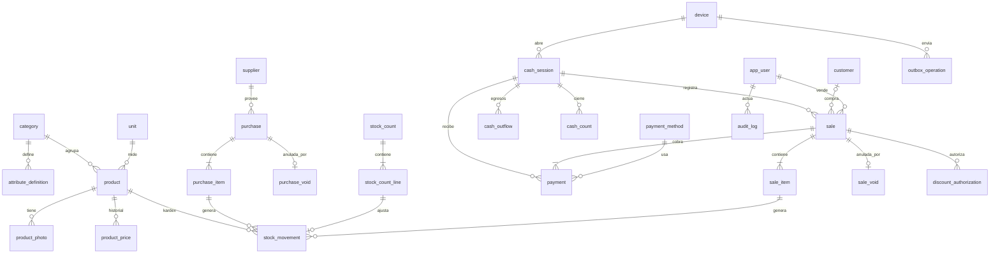

# Modelo de datos — SHT Gestión

| Campo | Valor |
|---|---|
| Versión | 0.1 |
| Fecha | 2026-10-07 |
| Estado | Borrador (etapa 1.0) |
| Documentos relacionados | `docs/PRD.md`, `docs/arquitectura.md`, `docs/decisiones/` |

> Modelo lógico de la base de datos (Postgres). Los nombres de tablas y columnas siguen el
> glosario de `docs/arquitectura.md` (ADR-0006). Cada etapa puede afinar columnas en su
> spec; los cambios de estructura se reflejan aquí y se aplican con migraciones Alembic.

## 1. Convenciones

### 1.1 Identificadores

- Toda tabla tiene `id uuid` como clave primaria, con **UUIDv7**. Las entidades creadas
  en el mostrador (caja, venta, ítems, pagos, egresos) reciben su `id` en el equipo, para
  poder crearse sin conexión (ADR-0003).
- Los números legibles (SKU, número de venta `A-000123`, número de compra) son columnas
  aparte con restricción de unicidad.

### 1.2 Tipos de dinero y cantidades (ADR-0004)

Se definen como **dominios** de Postgres, para declarar la escala en un solo lugar:

| Dominio | Tipo | Uso |
|---|---|---|
| `usd_amount` | `NUMERIC(14,2)` | Precios de venta y montos en USD |
| `usd_cost` | `NUMERIC(18,6)` | Costos en USD (incluido el promedio ponderado) |
| `ves_amount` | `NUMERIC(16,2)` | Montos en Bs |
| `rate` | `NUMERIC(18,8)` | Tasa BCV |
| `quantity` | `NUMERIC(14,2)` | Cantidades y stock |
| `percent` | `NUMERIC(5,2)` | Porcentajes de descuento (0–100) |

### 1.3 Otras convenciones

- **Enumeraciones** como `text` con restricción `CHECK`. Agregar un valor es una
  migración simple.
- **Fechas:** los instantes son `timestamptz`; la fecha de negocio (`business_date`) es
  `date` en `America/Caracas` (arquitectura §4.2).
- **Auditoría básica:** las tablas llevan `created_at`, y `created_by` cuando la acción
  la hace un usuario.
- **Nada se borra:** productos, usuarios, proveedores, categorías, unidades y métodos de
  pago se desactivan (`is_active`).

### 1.4 Inmutabilidad (RN-12, principio II)

| Tablas | Regla |
|---|---|
| `stock_movement`, `sale`, `sale_item`, `payment`, `sale_void`, `discount_authorization`, `cash_outflow`, `cash_count`, `purchase_void`, `product_price`, `audit_log` | Solo inserción |
| `purchase`, `purchase_item` | Editables en borrador; inmutables una vez confirmadas (RN-14) |
| `cash_session` | Editable solo para cerrarla; inmutable una vez cerrada (RF-33) |
| `outbox_operation` | Inmutable una vez procesada |

La regla se impone **en la base de datos**, no solo en el código: el rol de la API no
tiene permiso `DELETE` sobre estas tablas, y hay triggers que rechazan `UPDATE` (o lo
permiten solo en el estado editable).

## 2. Diagrama

## 3. Tablas

### 3.1 Usuarios, equipos y control

**`app_user`** (RF-44, RF-45; `user` es palabra reservada en Postgres)

| Columna | Tipo | Notas |
|---|---|---|
| `username` | text | Único, sin distinguir mayúsculas |
| `full_name` | text | |
| `role` | text | `admin` \| `seller` \| `warehouse` |
| `password_hash` | text | Argon2id (ADR-0005) |
| `pin_hash` | text, nulo | Solo admin |
| `pin_failed_attempts`, `pin_locked_until` | int, timestamptz | Límite de intentos del PIN |
| `is_active` | bool | |

**`device`** (ADR-0003)

| Columna | Tipo | Notas |
|---|---|---|
| `name` | text | Ej. "Mostrador principal" |
| `series` | text | Único y **nunca reutilizado**, incluso si el equipo se revoca (`A`, `B`, …) |
| `last_sequence_number` | int | Último correlativo sincronizado de la serie |
| `token_hash` | text | Token del equipo |
| `registered_by`, `registered_at`, `revoked_at` | | |

**`refresh_token`** (ADR-0005): `user_id`, `device_id` (nulo), `token_hash`, `expires_at`,
`revoked_at`, `replaced_by_id`.

**`audit_log`** (RF-46): `occurred_at`, `user_id`, `device_id`, `action` (ej.
`product.price_changed`, `exchange_rate.corrected`, `sale.voided`), `entity_type`,
`entity_id`, `before` jsonb, `after` jsonb, `reason`. Se escribe en la misma transacción
que la acción.

**`alert`** (RN-10, RN-14, ADR-0003): `type` (`negative_stock`, `price_mismatch`,
`total_mismatch`, `inactive_user_sync`, `purchase_void_cost`, `discount_review`, …),
`entity_type`, `entity_id`, `details` jsonb, `created_at`, `resolved_at`, `resolved_by`.

### 3.2 Productos (RF-01 a RF-07)

**`category`**

| Columna | Tipo | Notas |
|---|---|---|
| `name` | text | Mangueras, Conexiones, Ferrules, Ferretería (RF-03) |
| `sku_prefix` | text | Único: `MAN`, `CON`, `FER`, `FRT` (RF-02) |
| `next_sku_number` | int | Contador; se lee con bloqueo de fila al crear un producto |
| `default_unit_id` | uuid → `unit` | Unidad sugerida |
| `unit_locked` | bool | `true` en Mangueras: siempre por metro (RF-05) |
| `is_active` | bool | |

**`attribute_definition`** (RF-04): define qué atributos tiene cada categoría; el admin
los edita.

| Columna | Tipo | Notas |
|---|---|---|
| `category_id` | uuid → `category` | |
| `key` | text | Identificador en inglés, único por categoría (ej. `hose_type`, `thread`) |
| `label` | text | Texto en español (ej. "Tipo", "Rosca") |
| `data_type` | text | `text` \| `number` \| `option` |
| `options` | jsonb, nulo | Valores permitidos si es `option` (ej. R1, R2, R3) |
| `is_filterable` | bool | Aparece como filtro en el catálogo (RF-36) |
| `sort_order`, `is_active` | | |

**`unit`** (RF-05): `code` (`m`, `u`), `name` (metro, unidad), `decimals` (2 y 0),
`is_active`. El admin puede agregar unidades (caja, paquete).

**`product`**

| Columna | Tipo | Notas |
|---|---|---|
| `sku` | text | Único, `{prefijo}-{4 dígitos}`, generado (RF-02) |
| `category_id`, `unit_id` | uuid | |
| `name`, `description` | text | |
| `attributes` | jsonb | Valores según `attribute_definition`; validados por la API; índice GIN |
| `sale_price_usd` | `usd_amount` | Precio vigente con IVA incluido (RN-17); cada cambio crea un `product_price` |
| `avg_cost_usd` | `usd_cost` | Costo promedio ponderado (RN-09) |
| `stock` | `quantity` | Copia del saldo del kardex, actualizada en la misma transacción que cada movimiento |
| `min_stock` | `quantity` | Alerta de stock bajo (RF-11) |
| `is_active`, `is_published` | bool | `is_published`: aparece en el catálogo (RF-07) |
| `search_text` | tsvector generado | Búsqueda por nombre, descripción, SKU y atributos (RF-06); además índice trigram |

**`product_price`**: `product_id`, `price_usd`, `valid_from`, `set_by`. Histórico de
precios: sirve a la auditoría y a la validación de precios de ventas sin conexión
(ADR-0003).

**`product_photo`**: `product_id`, `storage_path` (Supabase Storage), `sort_order`.

### 3.3 Inventario (RF-08 a RF-12)

**`stock_movement`** (kardex; solo inserción)

| Columna | Tipo | Notas |
|---|---|---|
| `product_id` | uuid | |
| `type` | text | `purchase` \| `sale` \| `sale_void` \| `purchase_void` \| `adjustment` (RF-09) |
| `quantity_delta` | `quantity` | Con signo: positivo entra, negativo sale |
| `balance_after` | `quantity` | Stock resultante (RF-08); puede ser negativo (RN-10) |
| `adjustment_reason` | text, nulo | Obligatorio si `type = adjustment`: `physical_count` \| `damage` \| `loss` \| `correction` (RF-10) |
| `note` | text, nulo | Detalle libre del motivo |
| `cost_before_usd`, `cost_after_usd` | `usd_cost`, nulos | En compras y anulaciones de compra: costo promedio antes y después |
| `reference_type`, `reference_id` | text, uuid | `sale_item`, `purchase_item`, `stock_count_line`, … |
| `occurred_at` | timestamptz | |
| `created_by`, `device_id` | uuid | |

**`stock_count`** (RF-12): `status` (`open` \| `applied` \| `cancelled`), `started_by`,
`started_at`, `applied_by`, `applied_at`, `notes`.

**`stock_count_line`**: `stock_count_id`, `product_id`, `expected_quantity`,
`counted_quantity`. Al aplicar el conteo, cada diferencia genera un ajuste con motivo
`physical_count`. Cómo tratar las ventas ocurridas durante el conteo se define en la spec
de la etapa 1.1.

### 3.4 Compras (RF-13 a RF-16, RN-14)

**`supplier`**: `name`, `rif` (único, nulo), `phone`, `notes`, `is_active`.

**`purchase`**

| Columna | Tipo | Notas |
|---|---|---|
| `number` | text | Único, correlativo `C-000001` (las compras se registran con conexión) |
| `supplier_id` | uuid | |
| `purchase_date` | date | Fecha de negocio de la compra |
| `currency` | text | `USD` \| `VES` (RF-15) |
| `exchange_rate` | `rate` | Tasa BCV usada; siempre se guarda (RN-05) |
| `total_usd` | `usd_amount` | |
| `total_ves` | `ves_amount`, nulo | Solo si la compra es en Bs |
| `status` | text | `draft` \| `confirmed` |
| `confirmed_by`, `confirmed_at` | | |
| `notes` | text | |

**`purchase_item`**: `purchase_id`, `product_id`, `quantity`, `unit_cost_ves`
(`ves_amount`, nulo), `unit_cost_usd` (`usd_cost`; en compras en Bs = costo Bs ÷ tasa,
6 decimales), `line_total_usd`.

**`purchase_void`** (RN-14): `purchase_id` (único), `reason`, `voided_by`, `voided_at`.
Genera movimientos `purchase_void` inversos y recalcula el costo; si el resultado no es
válido, conserva el costo y crea una alerta `purchase_void_cost`.

### 3.5 Tasa de cambio (RF-17, RF-18, RN-15)

**`exchange_rate`**: `rate_type` (`BCV`; admite otros a futuro, RN-03), `business_date`,
`rate`, `created_by`, `created_at`, `updated_at`. Único por `(rate_type, business_date)`.
Es la única tabla de valores monetarios que admite corrección (RN-15); cada corrección
queda en `audit_log` con el valor anterior y el nuevo. Las ventas, pagos y compras
**copian** el valor de la tasa, así que una corrección no las altera.

### 3.6 Ventas (RF-20 a RF-28)

**`customer`** (RF-28): `name`, `document_id` (cédula o RIF, único, nulo), `phone`. En
la Fase 2 se agregan los datos de crédito.

**`payment_method`** (RF-24): `code`, `name`, `currency` (`VES` \| `USD` \| `USDT`),
`requires_reference`, `is_cash`, `is_active`. Datos iniciales:

| `code` | Nombre | Moneda | Referencia | Efectivo |
|---|---|---|:-:|:-:|
| `cash_ves` | Efectivo Bs | VES | ❌ | ✅ |
| `mobile_payment` | Pago móvil / transferencia | VES | ✅ | ❌ |
| `pos_card` | Punto de venta | VES | ✅ | ❌ |
| `cash_usd` | Efectivo USD | USD | ❌ | ✅ |
| `zelle` | Zelle | USD | ✅ | ❌ |
| `binance_usdt` | Binance USDT | USDT | ✅ | ❌ |

**`sale`** (RF-26; solo inserción)

| Columna | Tipo | Notas |
|---|---|---|
| `id` | uuid | Generado en el equipo |
| `device_id`, `series`, `sequence_number` | | Único `(series, sequence_number)` (RN-11) |
| `number` | text | `A-000123`, derivado de serie y correlativo |
| `cash_session_id` | uuid | Caja abierta del equipo (RF-30, RN-16) |
| `seller_id` | uuid → `app_user` | Quien hizo la venta |
| `customer_id` | uuid, nulo | |
| `occurred_at` | timestamptz | Hora del equipo |
| `synced_at` | timestamptz | Hora de llegada al servidor |
| `business_date` | date | |
| `exchange_rate` | `rate` | Copia de la tasa usada (RN-05) |
| `exchange_rate_date` | date | Fecha de esa tasa; puede ser anterior al día (RF-18) |
| `subtotal_usd` | `usd_amount` | Σ subtotales de línea − descuentos por ítem |
| `discount_type`, `discount_value` | text, numeric, nulos | Descuento sobre el total: `amount` \| `percent` (RF-22) |
| `discount_usd` | `usd_amount` | Descuento total en USD (0 si no hay) |
| `total_usd` | `usd_amount` | |
| `total_ves` | `ves_amount` | `total_usd × tasa`, redondeado (RN-02) |
| `device_total_usd` | `usd_amount` | Total calculado en el equipo, para detectar diferencias |
| `needs_review` | bool | Marcada para revisión del admin (ej. descuento sin conexión, si se permite) |
| `outbox_operation_id` | uuid | Operación que la creó |

**`sale_item`** (solo inserción)

| Columna | Tipo | Notas |
|---|---|---|
| `sale_id`, `line_number` | | |
| `product_id` | uuid | Un producto individual por línea (RN-13) |
| `quantity` | `quantity` | En la unidad del producto; ya convertida de cm a m (RF-21) |
| `unit_price_usd` | `usd_amount` | Precio con el que se vendió |
| `line_subtotal_usd` | `usd_amount` | Precio × cantidad, redondeado |
| `item_discount_type`, `item_discount_value` | nulos | Descuento del ítem: `amount` \| `percent` (RF-22) |
| `item_discount_usd` | `usd_amount` | |
| `allocated_sale_discount_usd` | `usd_amount` | Parte del descuento total asignada a la línea (ADR-0004) |
| `line_total_usd` | `usd_amount` | Subtotal − descuento del ítem − descuento asignado |
| `unit_cost_usd` | `usd_cost` | Costo promedio al registrarse la venta en el servidor (RF-42) |

**`discount_authorization`** (RN-07, RF-22): `sale_id`, `sale_item_id` (nulo = descuento
sobre el total), `authorized_by` (admin), `method` (`pin` \| `request` \| `self` cuando
el admin vende), `authorized_at`.

**`discount_request`**: solicitudes de descuento que el admin aprueba desde su sesión
(solo con conexión): `requested_by`, `device_id`, `details` jsonb, `status` (`pending` \|
`approved` \| `rejected`), `decided_by`, `decided_at`.

**`payment`** (RF-23 a RF-25; solo inserción)

| Columna | Tipo | Notas |
|---|---|---|
| `sale_id` | uuid | |
| `cash_session_id` | uuid | Caja donde entra o sale el dinero (puede diferir de la venta en una anulación) |
| `kind` | text | `sale_payment` (entra) \| `change` (vuelto, sale) \| `void_refund` (devolución por anulación, sale) |
| `payment_method_id` | uuid | |
| `currency` | text | Moneda del método |
| `amount` | `NUMERIC(16,2)` | Monto en la moneda del método, siempre positivo |
| `exchange_rate` | `rate` | Copia de la tasa de la venta (RN-05) |
| `amount_usd` | `usd_amount` | Equivalente en USD: Bs ÷ tasa (RN-06) o 1:1 (RN-04) |
| `reference` | text, nulo | Obligatoria si el método la exige (RF-24) |
| `sale_void_id` | uuid, nulo | Solo en `void_refund` |

**`sale_void`** (RF-27): `sale_id` (único), `reason`, `voided_by`, `voided_at`. Genera
movimientos de kardex `sale_void` y pagos `void_refund`. La caja de esos pagos depende de
la pregunta abierta de la etapa 1.4 (PRD §10); el modelo admite cualquier respuesta
porque cada pago indica su caja.

### 3.7 Caja (RF-29 a RF-33, RN-16)

**`cash_session`**

| Columna | Tipo | Notas |
|---|---|---|
| `id` | uuid | Generado en el equipo (puede abrirse sin conexión) |
| `device_id` | uuid | Como máximo una abierta por equipo (índice único parcial) |
| `business_date` | date | |
| `opened_by`, `opened_at` | | Quien la abre responde por ella (RN-16) |
| `opening_float_ves`, `opening_float_usd` | | Fondo inicial (RF-29) |
| `status` | text | `open` \| `closed` |
| `closed_by`, `closed_at` | | |

**`cash_outflow`** (RF-32): `cash_session_id`, `payment_method_id` (método en efectivo),
`amount`, `reason`, `created_by`, `occurred_at`.

**`cash_count`** (RF-31): una fila por método al cerrar: `cash_session_id`,
`payment_method_id`, `expected_amount`, `counted_amount`, `difference`.

**Esperado por método** = fondo inicial (solo efectivo) + Σ `sale_payment` − Σ `change`
− Σ `void_refund` − Σ `cash_outflow`, en la moneda del método. Lo calcula el equipo al
cerrar y el servidor lo recalcula al sincronizar.

### 3.8 Sincronización (ADR-0003)

**`outbox_operation`**: `id` (UUIDv7 del equipo = clave de idempotencia), `device_id`,
`user_id` (quien creó la operación), `operation_type` (`cash_session.open`,
`sale.create`, `cash_outflow.create`, `cash_session.close`), `schema_version`, `payload`
jsonb, `received_at`, `processed_at`, `status` (`processed` \| `failed`), `result` jsonb,
`error`.

## 4. Restricciones e índices clave

- Únicos: `app_user.username`, `device.series`, `category.sku_prefix`, `product.sku`,
  `(sale.series, sale.sequence_number)`, `purchase.number`,
  `(exchange_rate.rate_type, business_date)`, `sale_void.sale_id`,
  `purchase_void.purchase_id`, `customer.document_id`, `supplier.rif`.
- Único parcial: una `cash_session` con `status = 'open'` por `device_id`.
- `CHECK`: cantidades positivas en ítems y compras; `adjustment_reason` obligatorio en
  ajustes; `reference` obligatoria cuando el método la exige (validado en la API, porque
  depende de otra tabla); porcentajes entre 0 y 100.
- Decimales permitidos por unidad (`unit.decimals`): validados en la API.
- Índices: `stock_movement (product_id, occurred_at)`, `sale (business_date)`,
  `sale (seller_id, business_date)`, `payment (cash_session_id)`, GIN sobre
  `product.attributes` y `product.search_text`, trigram sobre `product.name`.

## 5. Previsiones para fases posteriores

No se implementan ahora; el modelo actual las permite sin rediseño.

**Fase 3 — Facturación fiscal (IVA e IGTF)**

- **IVA:** se agregará la alícuota por producto (general, reducida, exento). Como los
  precios incluyen IVA (RN-17), la base imponible de cada línea se obtiene de
  `line_total_usd`, que ya incluye el descuento total repartido, así que el desglose es
  correcto por línea.
- **IGTF:** cada pago guarda método, moneda y monto, que es lo que necesita el cálculo
  del impuesto a las transacciones en divisas.
- **Factura:** una tabla `fiscal_document` vinculada a la venta (número fiscal, número de
  control, medio de emisión). La venta y su número interno no cambian.
- **Cliente:** `customer.document_id` ya guarda la cédula o el RIF.

**Fase 2 — Crédito y nota de entrega**

- Crédito: datos de crédito en `customer`, un método o tipo de pago "crédito" y tablas de
  cuentas por cobrar y abonos (con tasa del día del abono, RF-49).
- Nota de entrega: se genera a partir de `sale`, `sale_item` y `payment`, que ya tienen
  todos los datos de RF-51.

## 6. Volumen estimado

Con ~1.000 productos y, por ejemplo, 50 ventas diarias de 4 ítems, se generan unas
75.000 líneas de venta y otros tantos movimientos de kardex por año. Son pocos megabytes
anuales, holgadamente dentro de los 500 MB de Supabase Free. Las fotos comprimidas son
el principal consumo de almacenamiento (1 GB en Free).
